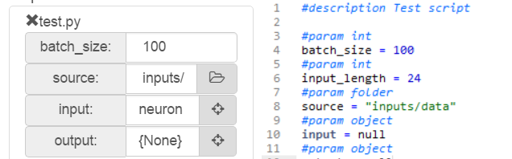

# 
A powerfull intuitive interface that allows anyone to create Machine Learning models!

The concept of AI-Blocs is to have a simple scene with draggable objects that have scripts attached to them. The models can be exported to a standalone script that runs on Tensorflow. 

Variables are parsed from python scripts and can be edited from the AI-Blocs properties panel.

### Download

All releases can be found here: https://github.com/MrNothing/AI-Blocks/releases/

### License

The program is distributed under the following license: https://creativecommons.org/licenses/by-nc/3.0/
