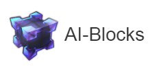

# 
A powerful and intuitive WYSIWYG interface that allows anyone to create Machine Learning models!


The concept of AI-Blocs is to have a simple scene with draggable objects that have scripts attached to them. The model can be run directly on the editor or be exported to a standalone script that runs on Tensorflow. 


Variables are parsed from python scripts and can be edited from the AI-Blocs properties panel.


### Install

The project requires python (https://www.python.org/) and tensorflow (https://www.tensorflow.org/) to run projects. You can still create and edit projects without these dependencies.

To run AI-Blocs, download the project archive and launch AI-Blocs.exe.

To run your model simply press the "Play" button and let the magic happen! 


### Download

All releases can be found here: https://github.com/MrNothing/AI-Blocks/releases/

### Build and Run

First type:
```npm install```
  
To run the project from the sources:
```npm run test```
  
To build the project from the sources:
```npm run pack```

### Documentation

Documentation and video tutorials can be found on the website: https://mrnothing.github.io/AI-Blocks/index.html

### License

The program is distributed under the following license: https://creativecommons.org/licenses/by-nc/3.0/

